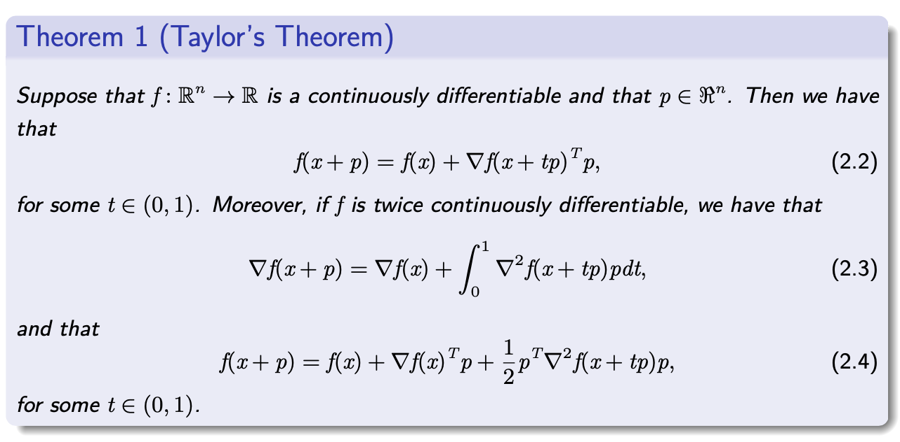

# 无约束优化基础

[>>前往教程目录](guide-opt.md)

## 数学基础

### 向量和矩阵

### 向量范数

### 对偶范数

### 矩阵范数

### 子空间

### 连续性

### 微分

### 收敛率

## 什么是解？

我们从优化问题的一个通常描述开始。给定一个函数 $f(x):R^n \rightarrow R$ 和一个集合 $S \subset R^n$，求一个 $x^*$ 的解
$$
\begin{array}{r}
\min f(x) \\
x \in R^{n}
\end{array}
$$
称为一个最优化问题。称 $f$ 是目标函数，$S$ 是可行域。如果 $S$​ 是空的，问题称为不可行的。如果能够找到点列 $x^k \in S$ 使得当 $k \rightarrow \infty$ 时， $f (x^k ) \rightarrow - \infty$ ，那么问题是无界的。

如果问题既不是不可行的也不是无界的，那么常常可以找到 $x^*\in S$ 满足
$$
f\left(x^{*}\right) \leq f(x), \forall x \in S
$$
这样的 $x^*$ 称为全局最小点。如果
$$
f\left(x^{*}\right)<f(x), \forall x \in S, x \neq x^{*},
$$
这样的 $x^*$ 称为严格的全局最小点。

在其他情形，我们可能只找到 $x^*\in S$ 满足
$$
f\left(x^{*}\right) \leq f(x), \forall x \in S \bigcap B_{x^{*}}(\varepsilon)
$$
其中 $B_{x^{*}}(\varepsilon)=\{x:\|x-x *\|<\varepsilon\}$.

这样的 $x^*$ 称为问题的局部最小点。类似地，可以定义严格局部最小点。

综上，我们给出了一些解的定义：全局最小解、局部最小解、严格局部最小解、孤立局部最小值。

举例：
$$
f(x) = x^4 \cos (\frac{1}{x}) + 2x^4, f(0) = 0
$$
所有的孤立最小值的点都是严格的，但是反之不对。

## Taylor定理

## 算法概述

- 两阶段的策略：线性搜索和信赖域

**线性搜索策略**

...

**信赖域**

...
