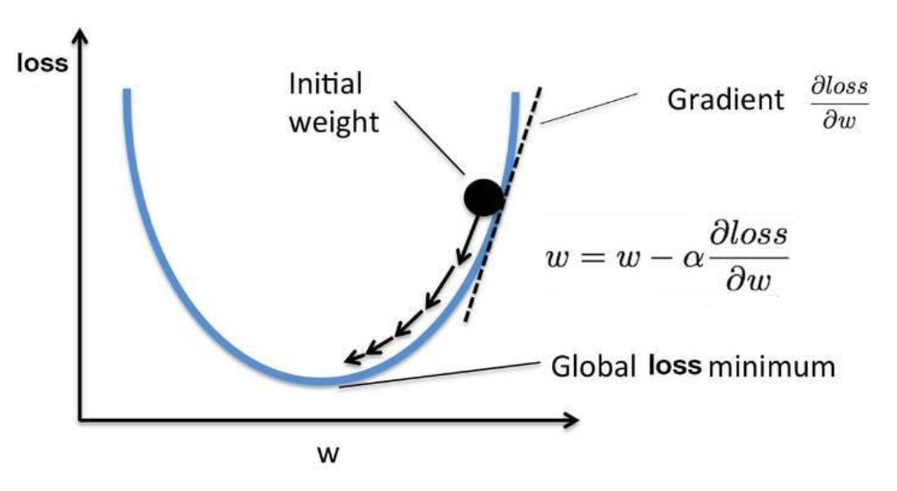
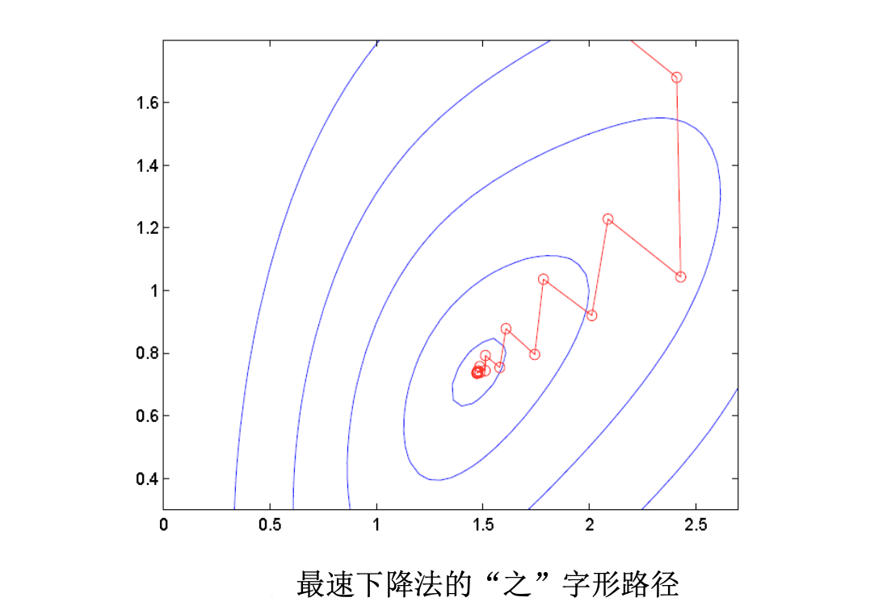

# 最速下降法

[>>前往教程目录](guide-opt.md)

我们现在开始研究多元变量的非线性优化问题。首先，我们关注无约束问题。一 个无约束非线性规划的典型例子出现在拟合和回归。研究无约束问题对于约束问题也非常重要，因为我们常常将一系列无约束问题作为求解有约束问题各种算法中的一个子问题

## 模型

一般形式的无约束优化模型为：
$$
\begin{array}{r}
\min f(x) \\
x \in R^{n}
\end{array}
$$
为了简单起见，我们仅限于讨论最小值问题，这个思想可以推广到最大值问题。

寻找最小值解的最简单的数值方法是基于沿着函数 $f$ 图形的梯度下降最快的方向的思想。当函数 $f$ 是可微时，它的梯度常常指向初始增长最快的方向，而负梯度方向就是下降最快的方向。这说明，如果我们现在估计最小值点是 $x^k$ ，最佳的移动方向是 $-\nabla f (x^k )$ 。一旦我们选定了这个方向，我们就需要用线性搜索法确定我们需要沿着这个方向移动多少，线性搜索问题是可以求解的单变量问题或可能是一 个近似的形式。这样我们就得到了一个新的最小值点的估计值，然后重复这个步骤。

## （算法）最速下降法

1. 取初始点 $x_0$，置 $k:=0$.
2. 计算 $g^k = g(x^k) = \nabla f(x^k)$
3. 若 $\nabla f(x^k) = 0$，则停止计算，否则继续沿着负梯度方向进行线性搜索，找到 $\alpha_k$：$f\left(x^{k}+\alpha_{k} d^{k}\right)=\min \left\{f\left(x^{k}+\alpha d^{k}\right) \mid \alpha \geq 0\right\}$.
4. 令 $x^{k+1} = x^k + \alpha_k d^k$，$k = k+1$.

最速下降法非常的容易实现而且有相对容易的迭代，但是它收敛到最优解的速度确实太慢了。

## 一类收敛性质

最速下降算法中的搜索方向取为当前点的负梯度方向。另外还有一些算法(如后面介绍的Newton法、共轭梯度 法等)，虽然并不是简单地把搜索方向取为负梯度方向，但是其搜索方向也于梯度方向有密切的关系。这些算法 与最速下降算法所选取的搜索方向之间有着某些共同特点，可以把它们归于一类进行研究。下面我们首先描述这 类算法的特征，然后讨论它的收敛性。

显然，这一类下降算法的特点是把搜索方向与负梯度方向之间的夹角 $\theta$ 限制在 $[0,\frac{\pi}{2})$。特别地，当 $f\left(x^{k}+\alpha_{k} d^{k}\right)=\min \left\{f\left(x^{k}+\alpha d^{k}\right) \mid \alpha \geq 0\right\}\rho=\cos \theta=\left\langle-\frac{g^{k}}{\left\|g^{k}\right\|}, \frac{d^{k}}{\left\|d^{k}\right\|}\right\rangle=1$ 时，就是最速下降法。

## 全局收敛性

**定理**：若目标函数 $f(x)$ 满足

1.  $f (x)$ 在 $R^n$ 上二次连续可微；
2. 对于 $\forall x^{\prime} \in R^n$，存在常数 $m>0$，使得 $x \in C\left(x^{\prime}\right)=\left\{x \in R^{n} \mid f(x) \leq f\left(x^{\prime}\right)\right\}, y \in R^{n}$ 时有，$m\|y\|^{2} \leq\langle y, G(x) y\rangle$，其中 $G(x)$ 为 $f(x)$ 在点 $x$ 的Hessian阵。

则从 $\forall x^0 \in R^n$ 出发，由最速下降算法产生的点列 $\{x^k\}$，必然满足：

- 当 $\{x^k\}$ 为有限序列时，其最后一个点必为 $f (x)$ 的唯一极小点；
- 当 $\{x^k\}$ 为无穷序列时，它必收敛于 $f (x)$ 的唯一极小点。

## 收敛速率

**定理**：设由最速下降算法产生的点列 $\{x^k\}$ 收敛于 $f(x)$ 的极小点 $x^*$。若 $f(x)$ 在 $x^*$ 的某一邻域内二次连续可微，且存在 $\epsilon >0,m>0$，使得当 $ || x-x^{*} \|<\varepsilon, y \in R^{n}$ 时，有 $m\|y\|^{2} \leq\langle y, G(x) y\rangle$，则 $\{x^k\}$ 至少线性收敛于 $x^*$。

注：最速下降算法的线性收敛速率已经无改进的余地。

