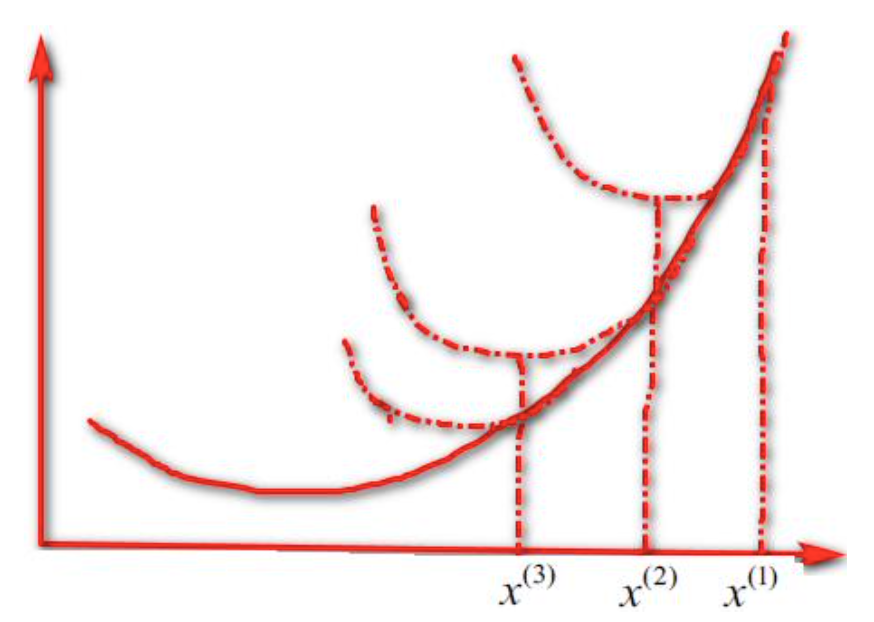

# 牛顿法

[>>前往教程目录](guide-opt.md)

这里有几种修正最速下降法的数值计算方法，减少这种逼近方法“之”字形的性质，因此提高了收敛速度。最速下降法应用了目标函数的梯度，只是函数一阶导数的信息。期望通过考虑二阶导数的信息也就是考虑曲率来进行改进。

## 解非线性方程组的牛顿法

我们先看一个涉及几个变量的一些方程
$$
\begin{array}{c}
f_{1}\left(x_{1}, x_{2}, \ldots, x_{n}\right)=0 \\
f_{2}\left(x_{1}, x_{2}, \ldots, x_{n}\right)=0 \\
\vdots \\
f_{n}\left(x_{1}, x_{2}, \ldots, x_{n}\right)=0
\end{array}
$$
将这个系统表示为：
$$
F(x) = 0
$$
这里 $x\in R^n$，$F = (f_1,\cdots,f_n)$。

首先，我们写出函数 $F(x)$ 在当前估计值 $x^k$ 处的一阶泰勒展开式：
$$
F\left(x^{k}+d^{k}\right) \approx \hat{F}\left(d^{k}\right):=F\left(x^{k}\right)+\nabla F\left(x^{k}\right) d^{k}
$$
其中：
$$
\nabla F\left(x_{1}, \ldots, x_{n}\right)=\left[\begin{array}{ccc}
\frac{\partial f_{1}}{\partial x_{1}} & \cdots & \frac{\partial f_{1}}{\partial x_{n}} \\
\vdots & \ddots & \vdots \\
\frac{\partial f_{n}}{\partial x_{1}} & \cdots & \frac{\partial f_{n}}{\partial x_{n}}
\end{array}\right]
$$
$\widehat{F}(d^k )$ 是线性逼近函数 $F$ 的超平面，这些超平面是函数 $F$ 在 $x^k$ 处的切平面。下一步是寻找 $d^k$ 值，使逼近值为 0，也就是：
$$
F\left(x^{k}\right)+\nabla F\left(x^{k}\right) d^{k}=0
$$
我们注意到等式右边是0向量，上面的方程是线性方程组。如果 $\nabla F(x^k )$ 是非奇异的，上面的等式有唯一解：
$$
d^{k}=-\nabla F\left(x^{k}\right)^{-1} F\left(x^{k}\right)
$$
此时的牛顿更新公式为：$x^{k+1}=x^{k}+d^{k}=x^{k}-\nabla F\left(x^{k}\right)^{-1} F\left(x^{k}\right)$.

## 最优化的问题的牛顿法

当我们使用牛顿法求解无约束优化问题时且目标函数 f (x) 是二次可微的，我们希望求解的非线性方程组是一阶最优性必要条件 $\nabla f (x) = 0$。
$$
F\left(x_{1}, x_{2}, \cdots, x_{n}\right)\left[\begin{array}{c}
f_{1}\left(x_{1}, x_{2}, \cdots, x_{n}\right) \\
f_{2}\left(x_{1}, x_{2}, \cdots, x_{n}\right) \\
\vdots \\
f_{n}\left(x_{1}, x_{2}, \cdots, x_{n}\right)
\end{array}\right]=\left[\begin{array}{c}
\frac{\partial f}{\partial x_{1}}\left(x_{1}, x_{2}, \cdots, x_{n}\right) \\
\frac{\partial f}{\partial x_{2}}\left(x_{1}, x_{2}, \cdots, x_{n}\right) \\
\vdots \\
\frac{\partial f}{\partial x_{n}}\left(x_{1}, x_{2}, \cdots, x_{n}\right)
\end{array}\right]=\nabla f(x)
$$
我们观察得，雅可比矩阵恰好是函数 $f$ 的 Hessian 阵：
$$
\nabla F\left(x_{1}, x_{2}, \ldots, x_{n}\right)=\left[\begin{array}{ccc}
\frac{\partial^{2} f}{\partial x_{1} \partial x_{1}} & \cdots & \frac{\partial^{2} f}{\partial x_{1} \partial x_{n}} \\
\vdots & \ddots & \vdots \\
\frac{\partial^{2} f}{\partial x_{n} \partial x_{1}} & \cdots & \frac{\partial^{2} f}{\partial x_{n}}
\end{array}\right]
$$
因此，牛顿更新公式为：
$$
x^{k+1}=x^{k}+d^{k}=x^{k}-\nabla f^{2}\left(x^{k}\right)^{-1} f\left(x^{k}\right)
$$
我们还可以从另一个角度导出牛顿法，即用一个二次函数去近似目标函数 $f (x)$，然后精确地求出这个二次函数的极小点，以此作为 $f (x)$ 极小点的近似。具体地，假设目标函数 $f (x)$ 二次连续可微，若极小点 $x^*$的第 $k$ 次近似值为 $x^k$，把 $f (x)$ 在 $x^k$ 点附近展开到二次项：
$$
f(x) \approx f\left(x^{k}\right)+\left(x-x^{k}\right)^{T} g^{k}+\frac{1}{2}\left(x-x^{k}\right)^{T} G_{k}\left(x-x^{k}\right)
$$
其中 $g^k,G_k$ 分别为 $f(x)$ 在 $x^k$ 点的梯度和 Hessian 阵。当 $G_k$ 为正定矩阵时，右端的二次函数有唯一极小点。牛顿法就是取这个极小点作为 $x^*$ 的第 k+1次近似 $x^{k +1}$ 。根据极小点的一阶必要条件知， $x^{k +1}$ 应该满足：$G_{k}\left(x^{k+1}-x^{k}\right)+g^{k}=0$.

从而：
$$
\begin{array}{c}
G_{k} d^{k}=-g^{k} \\
d^{k}=-G_{k}^{-1} g^{k} \\
x^{k+1}=x^{k}-G_{k}^{-1} g^{k}
\end{array}
$$

## （算法）牛顿法

1. 取初始点 $x_0$，置 $k:=0$.
2. 计算 $g^k = g(x^k) = \nabla f(x^k)$
3. 若 $\nabla f(x^k) = 0$，则停止计算，否则计算 $G_k$，并求出搜索方向 $d^k$.
4. 令 $x^{k+1} = x^k + d^k$，$k = k+1$.

## 牛顿法的收敛性定理

**定理**：设目标函数 $f (x)$ 是某一开域内的三次连续可微函数，且它在该域内有极小点 $x ^*$，且存在 $\epsilon >0,m>0$，使得当 $ || x-x^{*} \|<\varepsilon, y \in R^{n}$ 时，有 $m\|y\|^{2} \leq\langle y, G(x) y\rangle$，则由上述算法产生的点列 $\{x^k\}$ 收敛于 $x^*$，且收敛级为 2。

## 阻尼牛顿法

上面这个定理表明牛顿法具有非常好的局部收敛性质，在一定条件下，当初始点充分接近极小点时， 它是二次收敛的。但是若初始点离开极小点较远时，就不能保证牛顿法产生的点列收敛，甚至不能保证迭代过程中函数值的下降性。牛顿法的步长始终取作1，可以进行改进，沿牛顿方向进行一维搜索，这就是阻尼牛顿法。

**算法**

1. 取初始点 $x_0$，置 $k:=0$.
2. 计算 $g^k = g(x^k) = \nabla f(x^k)$
3. 若 $\nabla f(x^k) = 0$，则停止计算，否则计算 $G_k$，并求出搜索方向 $d^k$，进行线性搜索，找到 $\alpha_k$：$f\left(x^{k}+\alpha_{k} d^{k}\right)=\min \left\{f\left(x^{k}+\alpha d^{k}\right) \mid \alpha \geq 0\right\}$.
4. 令 $x^{k+1} = x^k + \alpha_k d^k$，$k = k+1$.

显然，阻尼牛顿法能够保证函数值在迭代过程中不会上升。下述定理说明，该算法具有全局收敛性。

**定理**：设目标函数 $f (x)$ 是某一开域内的二次连续可微函数，且它在该域内有极小点 $x ^*$，且存在 $\epsilon >0,m>0$，使得当 $ || x-x^{*} \|<\varepsilon, y \in R^{n}$ 时，有 $m\|y\|^{2} \leq\langle y, G(x) y\rangle$，

则从 $\forall x^0 \in R^n$ 出发，由阻尼牛顿算法产生的点列 $\{x^k\}$，必然满足：

- 当 $\{x^k\}$ 为有限序列时，其最后一个点必为 $f (x)$ 的唯一极小点；
- 当 $\{x^k\}$ 为无穷序列时，它必收敛于 $f (x)$ 的唯一极小点。

