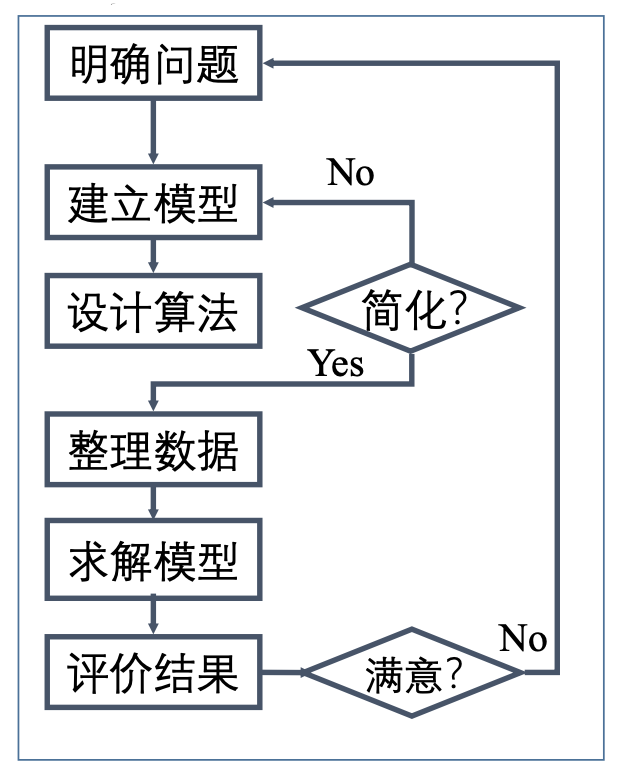

# 人工智能中的最优化

## 背景

人工智能在本质上也是一个最优化过程，对于我们要实现的智能，也是通过学习以求得最优解。这是一个总的大框架，人工智能的问题到最后几乎都是回到最优解问题。不管是传统的机器学习还是深度学习，或是强化学习，它们的基础核心思想都可以提升到最优化问题。 机器学习、深度学习的核心是算法模型，而最优化的任务就是告诉模型应该学什么、怎么学，所以在很多情况下，会将最优化作为算法模型的一部分。

模型学习的往往都是一个映射函数，需要运用大量数据，不断测试运行，才能发现模型中参数的优劣。 最优化的任务就是调整参数，向着好的方面调，假如没有最优化，模型就不知道该怎么学习而导致停滞不前。深度学习神经网络拥有大量参数，这些模型的学习需要一个目标函数，函数的功能是让模型的(识别)分类错误率尽量小。为了达到目的，模型的训练一般会给参数赋上随机初值，然后采用各种下降法来 寻找能让分类错误率更小的参数设置。

几乎所有的人工智能问题最后都会归结为一个优化问题的求解。因此，最优化理论和算法是机器学习及深度学习的支柱之一。机器学习绝大多数任务中优化的目标函数有特殊形式，根据其特殊结构设计及大规模数据的有效算法并研究算法的收敛性等理论问题。

机器学习中用到的优化算法包括一阶算法和二阶算法。一阶算法：如随机梯度下降法、共轭梯度法等；二阶算法：如基于BFGS或L-BFGS，截断牛顿法(Hessian-free)、Newton-CG 等。

随机梯度类算法研究和随机牛顿类算法是两类重要的算法。对这两类算法的进一步改进和收敛性等理论问题的研究是重要的研究方向。人工智能中的优化问题往往是非凸的。因此非凸优化、带正交约束优化和流形优化等问题研究对解决人工智能问题也非常重要。

## 参考书

1. Bertsekas, Nedic and Ozdaglar, Convex Analysis and Optimization, 2003.
2. Dimitri P. Bertsekas, Convex Optimization Theory, 2009.
3. Jorge Nocedal, Stephen Wright, Numerical Optimization, 2006.
4. Stephen Boyd, Lieven Vandenberghe, Convex Optimization, 2004.
5. 凸优化(Convex Optimization，by Stephen Boyd, Lieven Vandenberghe,) 王书宁等译，清华大学出版社，2013.

## 运筹学(OR)发展简介

- 从数百万年前的人类开始，每一项技术创新和每一项改善人类生活的发 明以及人类在地球上生存和繁荣的能力，都是由聪明人的狡猾思想设计 出来的。从火到车轮，从电力到量子力学，我们对世界的理解和我们周 围事物的复杂性已经增加到我们经常难以直观地掌握它们的程度。
- 运筹学：英国称为 Operational Research，美国称为 Operations Research
- 起源于二战期间的军事问题，如雷达的设置、运输船队的护航舰队的规 模、反潜作战中深水炸弹的深度、飞机出击队型、军事物资的存储等。
- 二战后运筹学应用于经济管理领域(LP、计算机)
- 1948年英国首先成立运筹学会;1952年美国成立。
- 1952年，Morse 和 Kimball出版《运筹学方法》
- 1959年成立国际运筹学联合会(IFORS)

运筹学是从本世纪三四十年代发展起来的一门新 兴学科，它的研究对象是人类对各种资源的运用 及筹划活动，它的研究目的在于了解和发现这种 运用及筹划活动的基本规律，以便发挥有限资源的最大效益，来达到总体、全局最优的目标。这里所说的“资源”是广义的，既包括物质材料， 也包括人力配备；既包括技术装备，也包括社会结构。

真正作为一门新兴学科的系统研究并予以正式命名的运筹学这段辉煌的创业史，是在二次大战前后揭开的。二次大战胜利后，美英各国运筹学的研究不但在军事部门继续予以保留，而且研究队伍还进一步得到扩大和发展，同时在政府和工业部门也开始推行运筹学方法，筹建运筹学小组。

## 运筹学的工作步骤

- 明确问题
- 建立模型
- 设计算法
- 整理数据
- 求解模型
- 评价结果

现代运筹学被引入中国是在五十年代后期。中国第一个运筹学小组在钱学森、 许国志先生的推动下在1956年于中国科学院力学研究所成立。钱学森先生在MIT取得硕士学位，在加州理工大学(California Institute of Technology)取得博士学位后成为该校的第一位Goddard讲座教授。许国 志先生在堪萨斯大学取得博士学位后，在马里兰大学流体力学和应用数学研 究所当研究员。他们两人是第一个运筹学小组的领导者。

1959年，第二个运筹学部门在中国科学院数学研究所成立，这是大跃进中数 学家们投身于国家建设的一个产物。力学所小组与数学所的小组于1960年合 并成为数学研究所的一个研究室，当时的主要研究方向为排队论、非线性规 划和图论，还有人专门研究运输理论、动态规划和经济分析(例如投入产出方法)。

五十年代后期，运筹学在中国的应用集中在运输问题上，其中一个广为流传容易明白的例子就是“打麦场的选址问题”，目的在于解决当时手工收割为主的情况下如 何节省人力和时间。国际上大家都知道的“中国邮路问题”(Chinese Postman Problem)模型也是在那 个时期由管梅谷教授提出的。这些都是典型的组合优化问题。所以，现在非常热门的“物流学”，在当时就有一些雏形的研究，但可惜中国的大工业落后，又不是市场环境，使我们在相当长的时期中远离了当代“物流学”的发展主流。

## 总结

最优化问题的共同特征：

- 每一个问题变量都用一组决策变量 $(x_1, x_2, \cdots, x_n)$ 表示某一方案，这组决策变量的值代表一个具体方案。
- 存在一定的约束条件，这些约束条件可以用一组线性 (或非线性)等式或线性(或非线性)不等式来表示。
- 目标函数用决策变量的线性(或非线性)函数来表示。 按问题的不同，要求目标函数实现最大化和最小化。

## 最优化问题分类

- CONSTRAINED AND UNCONSTRAINED OPTIMIZATION
- GLOBAL AND LOCAL OPTIMIZATION
- STOCHASTIC AND DETERMINISTIC OPTIMIZATION 
- CONTINUOUS VERSUS DISCRETE OPTIMIZATION

